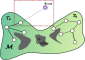
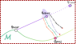
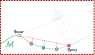
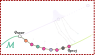

# McVAMP

Code for **Vectorizing Projection in Manifold-Constrained Motion Planning for Real-Time Whole-Body Control**

Shrutheesh R. Iyer, I-Chia Chang, Andrew Z. Liu, Yan Gu, Zachary Kingston

[Project page](https://commalab.org/papers/mcvamp/) · [arXiv](https://arxiv.org/abs/2604.13323) · [PDF](https://arxiv.org/pdf/2604.13323)


> Many robot planning tasks require satisfaction of one or more constraints throughout the entire trajectory.
> For geometric constraints, manifold-constrained motion planning algorithms are capable of planning a
> collision-free path between start and goal configurations on the constraint submanifolds specified by the task.
> Current state-of-the-art methods can take tens of seconds to solve these tasks for complex systems such as
> humanoid robots, making real-world use impractical, especially in dynamic settings. Inspired by recent advances
> in hardware accelerated motion planning, we present a CPU SIMD-accelerated manifold-constrained motion planner
> that revisits projection-based constraint satisfaction through the lens of parallelization. By transforming
> relevant components into parallelizable structures, we use SIMD parallelism to plan constraint-satisfying
> solutions. Our approach achieves up to 100 to 2000x speed-ups over the state-of-the-art, making real-time
> constrained motion planning feasible for the first time. We demonstrate our planner on a real humanoid robot
> and show real-time whole-body quasi-static plan generation.

<table>
  <tr>
    <td align="center" width="50%">
      <br>
      <sub>(a) Constrained extend step towards a randomly sampled configuration</sub>
    </td>
    <td align="center" width="50%">
      <br>
      <sub>(b) Multiple candidate projections around the sampled configuration</sub>
    </td>
  </tr>
  <tr>
    <td align="center" width="50%">
      <br>
      <sub>(c) Vectorized projection of interpolated configurations</sub>
    </td>
    <td align="center" width="50%">
      <br>
      <sub>(d) Recursive interpolation and projection up to the desired resolution</sub>
    </td>
  </tr>
</table>

This repository holds the planner, the code generator and the experiments. The planner is in `vamp/` (built on [VAMP](https://github.com/KavrakiLab/vamp)), `cricket/` generates the robot kinematics and constraint code from URDFs, and `experiments/` has the examples and benchmarks. Nothing here is a polished product; it is the code we ran, with the settings we ran it with.


# I dont want to read the slop, tell me how to start

Alright, just run 

```
pip install "vamp-planner @ git+https://github.com/CoMMALab/vamp.git@stack-4-mcvamp" -C cmake.define.VAMP_ROBOTS="ur5;panda;fetch;<robot-name>"
```

If for some reason that doesn't work out, please check out the correct branch from this subrepository linked in our repo and do a local `pip install . -C cmake.define.VAMP_ROBOTS="panda;..."`

List of available robots we have and the constraints they support for now

1. Panda, UR5, FR3 - EEF TSR constraints
2. bimanual_panda, bimanual_iiwa - EEF TSR Constraints, Fixed-bimanual-pose constraint
3. G1 - EEF TSR Constraints, Fixed-bimanual-pose constraint, CoM constraint inside a manually defined polygon
4. Digit - EEF TSR Constraints, Fixed-bimanual-pose constraint, CoM constraint inside a manually defined polygon, Closed-loop linkage constraint

Go to [Python examples](#6-python-examples)


## Contents

1. [Getting the code](#1-getting-the-code)
2. [Building the C++ examples](#2-building-the-c-examples)
3. [Running the C++ examples](#3-running-the-c-examples)
4. [Arguments](#4-arguments)
5. [Robots you have to generate (G1, Digit, iiwa)](#5-generating-robots-g1-digit-iiwa)
6. [Python examples](#6-python-examples)
7. [OMPL comparisons](#7-ompl-comparisons)
8. [Writing your own problem](#8-writing-your-own-problem)
9. [Things that go wrong](#9-things-that-go-wrong)
10. [Citation](#10-citation)

## 1. Getting the code

```bash
git clone --recursive <url of this repository> McVAMP
cd McVAMP
```

```
McVAMP/
├── vamp/          planner and constraint code (submodule, branch stack-4-mcvamp)
├── cricket/       code generator for robots (submodule, branch stack-3-mcvamp)
└── experiments/   examples and benchmarks
    ├── CMakeLists.txt
    ├── cpp/       C++ examples and the shared harness (common.hh)
    ├── python/    Python examples and visualization helpers
    └── assets/    scenes and start/goal files the examples read
```

You need CMake 3.16 or newer, a C++17 compiler (GCC 8+ or Clang 10+) and a CPU with AVX2 (x86-64) or NEON (ARM).
The first configure downloads vamp's dependencies and Eigen 3.4 if you do not have it.

## 2. Building the C++ examples

```bash
cmake -S experiments -B build/experiments -G Ninja     # drop -G Ninja to use Make
cmake --build build/experiments -j
```

The robot headers are tens of thousands of lines long, so compiling is slow and uses a lot of memory. Build one
target if you only want one thing:

```bash
cmake --build build/experiments --target digit_transport
```

Binaries land in `build/experiments/bin`. They know where `assets/` is from configure time, so you can run them from
any directory; set the environment variable `EXPERIMENTS_ASSETS_DIR` if you move the directory.

| CMake option | Default | What it does |
|---|---|---|
| `EXPERIMENTS_VAMP_SOURCE_DIR` | `../vamp` (relative to `experiments/`) | Which vamp checkout to build against. It is added as a subdirectory. |
| `EXPERIMENTS_GENERATED_ROBOT_DIR` | empty | Directory that contains `vamp/robots/g1_unitree.hh` and/or `vamp/robots/bimanual_iiwa.hh`. See [section 5](#5-generating-robots-g1-digit-iiwa). |
| `EXPERIMENTS_BUILD_OMPL` | `OFF` | Build the `ompl_*` examples. Point CMake at an installed OMPL with `-Dompl_DIR=<dir containing omplConfig.cmake>`. |
| `EXPERIMENTS_BUILD_PINOCCHIO` | `OFF` | Build `ompl_pinocchio`. Needs OMPL and pinocchio. |
| `EXPERIMENTS_FETCH_NLOHMANN_JSON` | `ON` | Download nlohmann_json if it is not installed. `crrtc_maze` and `task_space_projection` read JSON scenes. |
| `EXPERIMENTS_LTO` | `OFF` | Link-time optimization. |

vamp compiles with `-march=native -mavx2`, so build on the machine that runs the binaries. If you have to build
elsewhere, pass `-DVAMP_ARCH="-march=x86-64-v3 -mavx2"`.

## 3. Running the C++ examples

Every planning example (the ones marked "study" below) runs a full ablation by default: a grid over the planner and
projection settings, one attempt per grid point, timing each. It prints one line per solved attempt, slowest first,
and a count at the end:

```
------Final Result --------
# range, dynamic_domain, method, descend_rate, proj_iters, [perturbation,] insert_all(emit_all), planning_ms, planner_iterations, path_states[, simplify_ms, simplified_states, total_ms, simplified_cost], on_manifold
0.75, 0, 0, 0.75, 10, 1, 707.979, 9267, 165, 1
...
---------------------------
Solved 32/32 attempts
```

`method` is 0 for InnerLM, 1 for OuterLM, 2 for GradDesc. `on_manifold` is 1 if every waypoint of the path satisfies the
constraints. Failed attempts print `No path found with settings: ...`. The fastest attempt is written to a CSV
(one configuration per row), `trajectory.txt` unless you pass `--output`. Pass `--quick` to run a single
configuration instead of the grid.

Start and goal are projected onto the constraint manifold before planning. If that fails, or if the projected start or
goal is in collision, the example says so and exits without planning.

| Executable | Kind | What it does | Robot |
|---|---|---|---|
| `rrtc_example` | single run | Unconstrained RRT-Connect, as a baseline. | Panda |
| `crrtc_spheres` | study, 960 attempts | End effector constrained to a line, through a cage of spheres. | Panda |
| `crrtc_transport_mug` | study | End effector constrained to a plane, through a shelf. With the shelf as shipped there is no path; `--open_shelf` removes the top board. | Panda |
| `crrtc_maze` | study, 200 attempts | End effector constrained to a plane, through a cuboid maze, with a stick attached to the hand. | Panda |
| `task_space_projection` | debugging | Projects start, goal and a straight line of samples onto a task-space constraint and prints how each lane fared. | Panda |
| `benchmark_maze` | benchmark, 100 problems | One attempt per start/goal pair in the maze, pen attached, hand held in a plane. Prints the solve rate and time and iteration statistics. | Panda |
| `benchmark_line_plane` | benchmark, 1000 plane or 766 line problems | One attempt per problem: end effector on a line or in a plane, through its own random cuboids. | Panda |
| `bimanual_panda_projection` | debugging | Projects configurations onto a relative-pose manifold with GradDesc and InnerLM. | Bimanual Panda |
| `bimanual_panda_planning` | study, 1200 attempts | Both arms hold a rigid object (fixed relative pose) through a shelf. Same problem as `vamp/scripts/constrained_example.py --mode bimanual`. | Bimanual Panda |
| `digit_transport` | study, 32 attempts | Whole-body box transport: feet pinned, center of mass over the support polygon, leg loops closed, hands holding the box. | Digit |
| `g1_bimanual_planning` | study, 1200 attempts | Hands held 0.3 m apart. | G1 (generated) |
| `g1_com_planning` | study, 240 attempts | Feet pinned, center of mass over a small support polygon, hands held, in a humanoid shelf. | G1 (generated) |
| `g1_com_runner` | single run | Same constraints, different shelf, larger support polygon. | G1 (generated) |
| `g1_com_projection` | debugging | Projects G1 seed configurations onto the constraint stack. No planner. | G1 (generated) |
| `iiwa_bimanual_planning` | study, 288 attempts | Two iiwas hold one object through a shelf. | Bimanual iiwa (generated) |
| `ompl_*` | comparison | See [section 7](#7-ompl-comparisons). | Panda |

Examples that need a generated robot are skipped by CMake (it prints a `skipping` line) until the header exists.

### The grid

What each study varies. `{0,1}` means off/on.

| Example | Grid |
|---|---|
| `crrtc_spheres` | range {0.5, 1, 1.5, 2} x dynamic domain {0,1} x method {Inner, Outer} x descend rate {0.75, 1} x projection iterations {5, 10, 25, 50, 100} x insert-all {0,1} x perturbation {0.01, 0.1, 0.2} |
| `crrtc_maze` | range {0.5, 0.75, 1, 0.1, 0.2} x dynamic domain {0} x method {Inner, Outer} x descend rate {0.75, 1} x iterations {5 ... 100} x insert-all {0,1} |
| `bimanual_panda_planning`, `g1_bimanual_planning` | range {0.5, 0.75, 1, 1.5, 2} x dynamic domain {0,1} x method {Inner, Outer} x rate {0.75, 1} x iterations {5 ... 100} x insert-all {0,1} x perturbation {0.01, 0.1, 0.2} |
| `g1_com_planning` | range {0.5, 0.75, 1} x dynamic domain {0,1} x method {Inner, Outer} x rate {0.75, 1} x iterations {5 ... 100} x insert-all {0,1} |
| `digit_transport` | range {0.75, 0.5} x dynamic domain {0,1} x method {Inner} x rate {0.75, 1} x iterations {10, 25} x insert-all {0,1} |
| `iiwa_bimanual_planning` | range {1, 1.25} x dynamic domain {0,1} x method {Inner, Outer} x rate {0.5, 1} x iterations {5, 10, 25} x insert-all {0,1} x perturbation {0.01, 0.1, 0.2} |

How a grid knob maps to the library:

| Knob | Setting in vamp | Meaning |
|---|---|---|
| range | `RRTCSettings::range` | Longest extension of the tree towards a sample. |
| dynamic domain | `RRTCSettings::dynamic_domain` (radius fixed per example) | Restricts where samples can extend a node, to escape local minima. |
| method | `ConstraintSettings::method` | Projection solver: `InnerLM`, `OuterLM` or `GradDesc` (Levenberg-Marquardt variants, or gradient descent). |
| descend rate | `ConstraintSettings::descend_rate` | Step scale of each projection iteration. |
| projection iterations | `ConstraintSettings::max_iterations` | Iteration cap of one projection. |
| insert-all | `ConstraintSettings::emit_all_waypoints` | Put every projected waypoint of an extension in the tree, or only the last. |
| perturbation | `ConstraintSettings::perturbation_scale` | Spread of the extra projection candidates around a sample (the SIMD lanes). |

### Benchmark problem sets

`benchmark_maze` and `benchmark_line_plane` come from the constrained benchmarker. They run many independent problems
with one fixed set of settings instead of a grid, and print how many were solved and the time and iteration
statistics of the solved ones. The problems are in `experiments/assets/problems/benchmark/`:

| File | Problems | What |
|---|---|---|
| `maze_pen_problems.json` | 100 | start and goal in the maze scene, pen attached, hand free in a plane |
| `plane_problems.json` | 1000 | hand free in a plane, each with its own cuboids (100 problems per obstacle-count bin) |
| `line_problems.json` | 766 | hand free along a line, each with its own cuboids |

Settings follow the originals. Maze: range 0.4, 20 projection iterations, one sampler shared by all problems. Line and
plane: range 1, 15 projection iterations, a fresh sampler per problem. Both use OuterLM, descend rate 1, perturbation
0.1, insert-all waypoints, no dynamic domain, and 200000 planner iterations. For line and plane the orientation bounds
in the files are opened to +-1000 so only position is constrained, as the original did (`--keep_orientation` keeps them).
Unlike the original, the path is simplified with the same projection settings as planning, because the new
`simplify` takes no separate method, rate or iteration count.

```bash
./build/experiments/bin/benchmark_maze
./build/experiments/bin/benchmark_line_plane --problems=plane      # or --problems=line
python experiments/python/benchmark_maze.py
python experiments/python/benchmark_line_plane.py --problems=line
```

The original had a ten-problem "marker" maze set as well. It uses a Panda variant with a marker end effector
(`panda_marker`) that is not in this tree, so it is not included.

Results on this tree (C++, GCC, one core; median time for the solved problems): maze 79 of 100 solved (4.4 ms), plane
1000 of 1000 (0.34 ms), line 758 of 766 (0.11 ms). The original runs of the same sets solved 79 and 82 of 100 on the maze
and 1000 of 1000 on the plane set.

## 4. Arguments

Arguments are `--key=value` or, for switches, `--flag`.

### Shared by every study and by `g1_com_runner`

| Argument | Default | What it does |
|---|---|---|
| `--quick` | off | One configuration (the example's defaults) instead of the whole grid. |
| `--trials=N` | 1 | Repeat each configuration N times. |
| `--planner=NAME` | `rrtc` | `rrtc`, `aorrtc` or `grrtstar`. |
| `--range=R` | the grid's | Fix the planner range. With `--quick` it sets the single run; without, it overrides every grid point. |
| `--max_iterations=N` | 100000 | Planner iteration budget per attempt. |
| `--output=FILE` | `trajectory.txt` | CSV of the fastest attempt. `crrtc_spheres` writes `spheres.txt` instead. |
| `--raw_seeds` | off | Give start and goal to the planner without projecting them first. |

### Projection settings

These set `ConstraintSettings` for everything in the run, including the projection of start and goal. The values in use
are printed on a `constraint settings` line at the top.

| Argument | Default | What it does |
|---|---|---|
| `--tolerance=T` | `1e-6` | Squared constraint violation below which a projection counts as converged. `1e-4` is several times faster on the humanoid stacks and allows about 1 cm and 0.01 rad of slack. |
| `--hold_satisfied_rows[=false]` | true | Whether rows of the projection Jacobian that belong to already-satisfied components stay in. See below. |
| `--connect_slack=X` | 2 | Passed to `ConstraintSettings::connect_slack`. |
| `--reached_radius2=X` | 0.01 | Passed to `ConstraintSettings::reached_radius2`. |
| `--endpoint_tolerance2=X` | `1e-6` | Passed to `ConstraintSettings::endpoint_tolerance2`. |

**`--hold_satisfied_rows`.** The constraint error is a hinge: a component inside its bounds has zero error. With the
option on (the default), the Jacobian rows of those components stay in the projection step, so the step keeps them where
they are while it fixes the violated components. With `--hold_satisfied_rows=false`, those rows are zeroed and the step
may move them anywhere inside their bounds. The manifold is the same either way. The effect on planning speed depends
on the problem. On the maze and on G1 with a world-frame center of mass, keeping the rows was faster in our runs. On Digit it was
mixed, and with a center of mass measured relative to the feet it was often much slower. Try both on a new problem.

### Benchmarks

`benchmark_maze` and `benchmark_line_plane` do not take the study flags above (`--quick`, `--trials`, `--output`). They take:

| Argument | Default | What it does |
|---|---|---|
| `--planner=NAME` | `rrtc` | `rrtc`, `aorrtc` or `grrtstar`. |
| `--first=I --limit=N` | 0, all | Run problems I, I+1, ... for N problems. |
| `--results=FILE` | none | Write one JSON record per problem: success, solve time (ns), iterations, obstacle count, path cost. |
| `--max_iterations=N` | 200000 | Planner iteration budget per problem. |
| `--range=R` | 0.4 maze, 1 line/plane | Planner range. |
| `--problems=plane\|line` | `plane` | Line/plane set (`benchmark_line_plane` only). `--file=PATH` runs another file in the same format. |
| `--keep_orientation` | off | Keep the orientation bounds from the file instead of opening them (`benchmark_line_plane` only). |
| `--raw_seeds`, `--tolerance`, `--hold_satisfied_rows`, `--connect_slack`, `--reached_radius2`, `--endpoint_tolerance2` | as above | Same meaning as for the studies. |

The Python scripts take the same options with Fire syntax, plus `--range_` for the range.

### Example-specific

| Example | Argument | What it does |
|---|---|---|
| `crrtc_transport_mug` | `--open_shelf` | Remove the top board so a path exists. |
| `digit_transport` | `--no_transport` | Drop the hand-to-hand constraint, so the robot walks free. |
| `digit_transport` | `--empty` | Plan in an empty scene instead of the shelf. |
| `task_space_projection` | `--iterations=N` (100), `--method=InnerLM\|OuterLM\|GradDesc`, `--output=FILE` | Projection iteration cap, solver, path CSV. |
| `g1_com_projection` | `--output=FILE` | Where to write the projected configurations. |

`rrtc_example` and `bimanual_panda_projection` take no arguments.

## 5. Generating robots (G1, Digit, iiwa)

Robot headers come from `cricket`, which reads a URDF and an SRDF and writes a header with forward kinematics, sphere
collision checking and the constraint kernels (task-space, relative pose, center of mass, closed loop). Some are
already in `vamp/src/impl/vamp/robots/`; the steps below regenerate them or add the ones that are missing. The
recipes are in `cricket/resources/`.

Build cricket first (see its README), then, from `cricket/resources/`:

```bash
../build/fkcc_gen digit.json            # writes the file named by "output" in the current directory
```

| Recipe | Output | Copy it to | Used by |
|---|---|---|---|
| `digit.json` | `digit_fk.hh` | `vamp/src/impl/vamp/robots/digit.hh` | `digit_transport`, `digit_transport_sequence.py` |
| `g1_unitree.json` | `g1_unitree_fk.hh` | `<dir>/vamp/robots/g1_unitree.hh` | `g1_*` |
| `bimanual_iiwa.json` | `bimanual_iiwa_fk.hh` | `<dir>/vamp/robots/bimanual_iiwa.hh` | `iiwa_bimanual_planning` |

Then point CMake at `<dir>` (copying into `vamp/src/impl/vamp/robots/` also works):

```bash
cmake -S experiments -B build/experiments -DEXPERIMENTS_GENERATED_ROBOT_DIR=<dir>
cmake --build build/experiments --target g1_com_planning
```

Details that matter:

- **End-effector order.** The G1 examples expect left hand, right hand, left foot, right foot. Digit expects left hand,
  right hand, left toe, right toe. The recipes already have this order.
- **Center of mass frame.** The `"com"` key in a recipe picks the frame. `"com": true` and `{"frame": "world"}` give the
  world-frame center of mass; `{"frame": "feet", "reference_frames": [...]}` gives it relative to the mean position of
  those frames. All recipes shipped here use the world frame, and the support polygons in the examples are written for
  it. If you generate a foot-relative robot you have to shift the polygons yourself.
- **G1.** `g1_unitree.json` has a six-joint Euler base (35 dimensions) and is the struct `G1Unitree`. The examples convert
  their seed configurations to the layout of the header you generated.
- **Digit.** 31 dimensions: a quaternion free-flyer base and 24 joints, including a shin joint in each leg. The sample
  dimension is 30.
- **iiwa.** The recipe uses `iiwa_*_iiwa_link_7` as end effectors. The upper shelf board is lowered by 3 cm in
  `experiments/assets/environments/shelf/iiwa.txt` because the start configuration touches it with this collision model.
- **Visual meshes** of G1 and iiwa are not copied; collision uses spheres only.

Python modules for the generated robots are not built by default; generating a robot at run time from Python is possible (`vamp.jit.load_robot`), but needs a much larger toolchain
(pinocchio, CGAL, CppAD, LLVM). Build vamp with `VAMP_BUILD_JIT=ON`.

## 6. Python examples

**The default `pip install` only builds Panda, UR5 and Fetch.** Every robot compiled into the Python module adds a very
large header to the build, so the heavier ones are opt-in. `bimanual_panda_example.py` needs `bimanual_panda`,
`digit_transport_sequence.py` needs `digit`. Choose the robots when you install:

```bash
cd vamp
pip install . -C cmake.define.VAMP_ROBOTS="ur5;panda;fetch;bimanual_panda;digit"   # the robots the examples below use
pip install . -C cmake.define.VAMP_ROBOTS=all                                      # every robot vamp has bindings for
```

Known names: `sphere`, `ur5`, `panda`, `bimanual_panda`, `fetch`, `baxter`, `digit`, `r2c6`, `bimanual_iiwa`, `g1_unitree`.
Building takes several minutes, and longer the more robots you ask for (G1 is the largest header). `bimanual_iiwa` and
`g1_unitree` are registered but I have not built them as Python modules yet. A script that needs a robot your build lacks exits and prints the install command.

```bash
pip install fire scipy viser yourdfpy                # example dependencies
python -c "import vamp; print(vamp.robots)"          # the robots in your build
```

Run the scripts from anywhere. They find `experiments/assets/` next to themselves and robot files through `VAMP_ROOT` (default
`vamp/`). They use [Fire](https://github.com/google/python-fire), so arguments are `--key=value`. Extra keywords are
passed to vamp's planner settings (for example `--dynamic_domain=False`).

| Script | Run | What it does |
|---|---|---|
| `panda_plane_example.py` | `python experiments/python/panda_plane_example.py` | Panda hand slides in a horizontal plane through a sphere cage. |
| `bimanual_panda_example.py` | `python experiments/python/bimanual_panda_example.py` | Both Panda arms hold one object through a shelf. |
| `digit_transport_sequence.py` | `python experiments/python/digit_transport_sequence.py --output_prefix=leg` | Digit reaches, then carries a box (the box's spheres are attached to the hand). Writes `leg_0.csv`, `leg_1.csv`, ... |
| `g1_bimanual_com_example.py` | `python experiments/python/g1_bimanual_com_example.py --quick` | G1 with feet, center of mass and hands. Needs a G1 module (see below). |
| `benchmark_maze.py`, `benchmark_line_plane.py` | `python experiments/python/benchmark_maze.py` | The benchmark problem sets, one attempt per problem (see "Benchmark problem sets"). Need `panda`. |
| `maze_meshcat_example.py` | `python experiments/python/maze_meshcat_example.py` | Level end effector with a stick through the maze, played back in meshcat. Needs pinocchio and meshcat. |
| `viser_dynamic_obstacle_avoid.py`, `viser_ros_listener.py` | | Replan around a moving obstacle over ROS 2, and the matching viewer. Need ROS 2 (`rclpy`). |

Arguments:

| Script | Arguments (default) |
|---|---|
| `panda_plane_example.py` | `--planner` (`rrtc`; also `aorrtc`, `grrtstar`), `--range_` (0.5), `--obstacle_radius` (0.15), `--repeat` (20 timing runs), `--visualize` (off) |
| `bimanual_panda_example.py` | `--planner`, `--range_` (1.0), `--tolerance` (0.001, half-width of the relative-pose bounds), `--shelf` (`experiments/assets/environments/shelf/drake.txt`), `--repeat` (20), `--visualize` |
| `digit_transport_sequence.py` | `--planner`, `--range_` (0.75), `--projection_iterations` (25), `--attachment_radius` (0.02), `--output_prefix` (empty: write nothing), `--visualize` (off) |
| `g1_bimanual_com_example.py` | `--planner`, `--shelf` (`.../humanoid.txt`), `--trials` (10 rounds over the grid), `--quick` (one configuration, one round), `--visualize` (off) |
| `benchmark_maze.py`, `benchmark_line_plane.py` | the benchmark options above, plus `--visualize` (off) |
| `maze_meshcat_example.py` | `--planner`, `--range_` (0.5), `--attachment_radius` (0.01), `--visualize` (on) |

`--visualize` opens a [viser](https://github.com/nerfstudio-project/viser) viewer at `http://localhost:8080` with a slider
and autoplay over the path (needs `viser` and `yourdfpy`). The benchmarks show the first problem they solve (use `--first=I
--limit=1` for problem I): robot, obstacles, the line or plane the hand is held to, and the pen in the maze. Digit plays all
three legs in sequence, with the box in its hand during the transport legs. G1 is drawn as its collision spheres, because its
visual meshes are not in this tree. Robot URDFs come from `VAMP_ROOT` (default `vamp/`).

The scripts print planning time, path length before and after simplification, and whether every waypoint satisfies the
constraints. `g1_bimanual_com_example.py` looks for a `vamp.g1_unitree` module, so install with `g1_unitree` in `VAMP_ROBOTS`; otherwise
it exits with a message.

The scripts `constrained_example.py` (`--mode line|plane|bimanual`), `digit_example.py` and `r2_handrail_example.py` live in
`vamp/scripts/`. `constrained_example.py` takes the same projection settings as the C++ side with a `--constraint_`
prefix (`--constraint_tolerance`, `--constraint_hold_satisfied_rows`, `--constraint_emit_all_waypoints`, ...) and prints the
values it uses.

## 7. OMPL comparisons

These use OMPL for the planning and vamp for collision checking and the constraint projection. They need the vamp fork of
OMPL, whose `Constraint` class has a virtual `project(State *)`; stock OMPL does not. Configure with
`-DEXPERIMENTS_BUILD_OMPL=ON -Dompl_DIR=<install dir of OMPL>`. `ompl_DIR` must be an installed OMPL, not a build tree.

| Executable | Arguments | What it does |
|---|---|---|
| `ompl_unconstrained` | none | BIT* with vamp collision checking. Baseline. |
| `ompl_constrained_projected` | `--range=1.0`, `--max_iterations=100000`, `--ompl_motion`, `--output=FILE` | OMPL `ProjectedStateSpace` and RRT-Connect, with vamp's projection and edge validation. `--ompl_motion` uses OMPL's own geodesic instead. |
| `ompl_constrained_statespace` | `--scene=maze\|cage`, `--method=InnerLM\|OuterLM\|GradDesc`, `--range=1.0`, `--time=100`, `--output=FILE` | OMPL drives everything through its `Constraint` interface. Defaults: OuterLM on the maze, InnerLM on the cage. |
| `ompl_pinocchio` | `--range=1.0`, `--time=50`, `--output=FILE` | Same problem with the constraint evaluated by pinocchio, as a reference. Needs `-DEXPERIMENTS_BUILD_PINOCCHIO=ON`. |

## 8. Writing your own problem

C++, using the same pieces as `experiments/cpp/common.hh`:

```cpp
namespace vc = vamp::planning::constraint;
using TSR = vc::TaskSpaceConstraint<Robot, rake>;

vc::ConstraintSettings settings;                       // method, descend_rate, max_iterations, ...
std::vector<std::shared_ptr<const vc::Constraint<Robot, rake>>> constraints = {
    std::make_shared<TSR>(rTe, wTr, lower, upper)};    // per-end-effector arrays; quaternions are wxyz
vc::ConstraintSet<Robot, rake> set(constraints, settings);
set.project(start); set.project(goal);                 // seeds must be on the manifold
vc::ConstrainedLocalPlanner<Robot, rake, Robot::resolution> lp(set);

auto result = vamp::planning::RRTC<Robot, rake, Robot::resolution>::solve(start, goal, env, rrtc_settings, rng, lp);
auto simple = vamp::planning::simplify<Robot, rake, Robot::resolution>(result.path, env, simplify_settings, rng, lp);
```

`TaskSpaceConstraint` takes `(rTe, wTr, lower, upper)`: the end-effector offset frame, the reference frame, and the lower
and upper bound of each of the six pose components (x, y, z, then rotation as a log map) for every end effector. A
bound pair wider than 0.5 is a slab that leaves that component mostly free; narrower is treated as pinning it.

Constraints cache Jacobians between calls and are not thread-safe. Build one `ConstraintSet` per thread. A
`Robot::Configuration` is a 1 x dimension vector, so index it `q[{0, i}]`.

To add a study that prints the usual summary, fill in an `experiments::Problem` (start, goal, environment, a function
that builds the constraints, the grid) and call `experiments::run`. `experiments/cpp/digit_transport.cc` is the shortest complete
example.

## 9. Things that go wrong

- **"projected start configuration is in collision."** The start (or goal) hits an obstacle once it is on the manifold.
  Try `--raw_seeds` to see whether it was already in collision before projection. Whether a seed is valid depends on
  the robot's collision spheres, so seeds made for one model can fail on another.
- **"start/goal projection onto the manifold did not converge."** The seed is far from the manifold, or the
  tolerance is too tight for the iteration budget.
- **No path.** Constrained extensions have to be short: try `--range=0.3` to `0.75` and more projection iterations. The
  full study shows which combinations work.
- **Planning never converges on a Clang build.** Do not compile with `-fno-honor-nans` or `-ffinite-math-only`. The
  constraint code depends on NaN handling (the rotation error is NaN exactly at satisfied orientations and the hinge
  clears it). The flags vamp sets for Clang leave NaNs alone; if you added them yourself, remove them. Also keep
  `-fno-strict-aliasing`, which the CMake files set.
- **Illegal instruction.** Binary built for a different CPU; see the architecture note in section 2.
- **Asset not found.** The assets path is fixed at configure time. Re-run CMake or set `EXPERIMENTS_ASSETS_DIR`.
- **`ValueError ... violates the constraints; project it first` from Python.** Planner inputs must lie on the manifold.
  Call `module.project(q, constraints, constraint_settings)` first, with a larger `max_iterations` than the planner uses.
- **`find_package(vamp)` mode** (`-DEXPERIMENTS_USE_VAMP_SUBDIRECTORY=OFF`) does not work with the current vamp install
  rules. Use the default.
- **OMPL configure error mentioning `OMPL_INCLUDE_DIRS`.** `ompl_DIR` points at a build tree. Use an installed OMPL.

## 10. Citation

```bibtex
@misc{iyer2026vectorizingprojectionmanifoldconstrainedmotion,
  title         = {Vectorizing Projection in Manifold-Constrained Motion Planning for Real-Time Whole-Body Control},
  author        = {Shrutheesh R Iyer and I-Chia Chang and Andrew Z. Liu and Yan Gu and Zachary Kingston},
  year          = {2026},
  eprint        = {2604.13323},
  archivePrefix = {arXiv},
  primaryClass  = {cs.RO},
  url           = {https://arxiv.org/abs/2604.13323}
}
```
